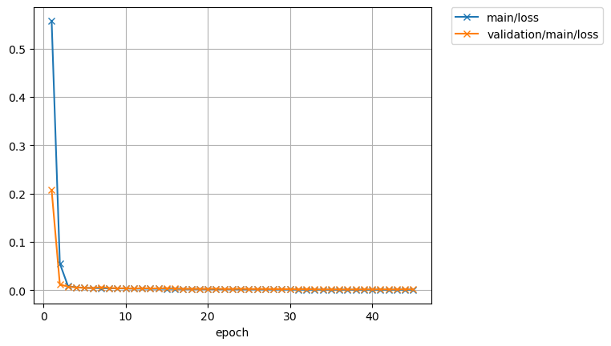
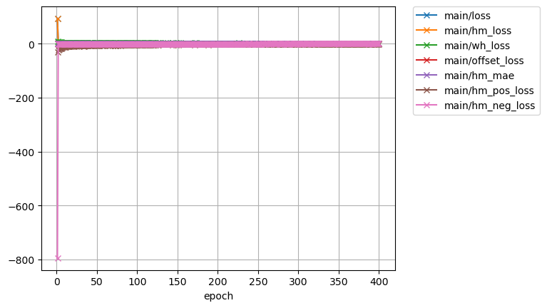
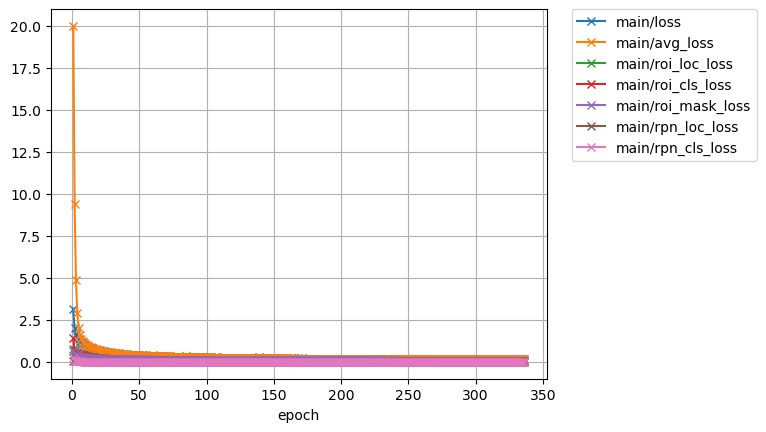
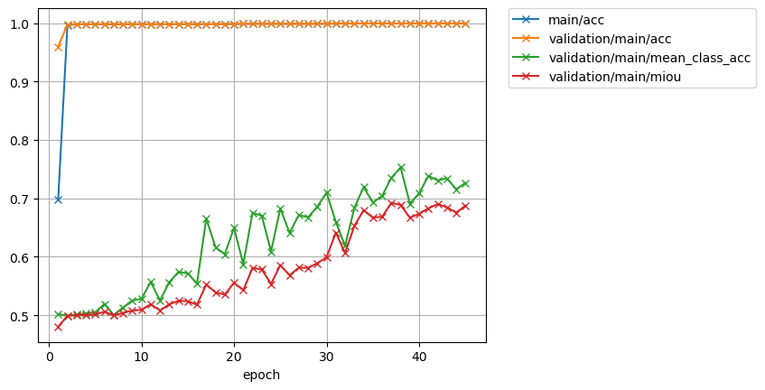
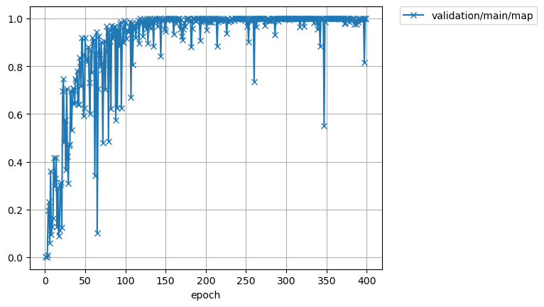
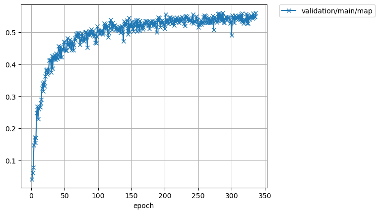

# CTU-Chainer 深度学习工具包使用文档
## 一、项目介绍
CTU-Chainer 是一套轻量化且高性能的深度学习训练与推理工具包，聚焦于工程化落地场景下的效率优化，同时覆盖计算机视觉领域四大核心任务。

### 核心特性
1. **多模式训练/推理支持**：核心文件 `ctu_chainer_full.py` 内置多进程、多线程、多队列线程三种执行模式，可适配不同硬件环境与任务延迟要求；
2. **全场景覆盖**：配套实现深度学习领域四大经典计算机视觉任务，开箱即用；
3. **易扩展**：代码结构清晰，可快速适配自定义数据集、网络结构与训练策略。

### 文件说明
| 文件名 | 功能说明 |
|--------|----------|
| `ctu_chainer_full.py` | 核心调度文件，集成多进程/多线程/多队列线程的训练、预测逻辑 |
| `image_classification.py` | 图像分类任务实现（含数据加载、模型定义、训练验证） |
| `object_detection.py` | 目标检测任务实现（支持主流检测框架适配） |
| `semantic_segmentation.py` | 语义分割任务实现（像素级分类逻辑） |
| `instance_segmentation.py` | 实例分割任务实现（区分同一类别不同实例） |

## 二、使用方法
### 1. 环境准备
#### 基础依赖
```bash
# 可直接下载已经打包好的文件


# 自行安装python版本及安装核心依赖
> python -m pip install --upgrade pip
> python -m  pip install setuptools==58.0.0
> python -m pip install chainer cupy-cuda101 opencv-python blinker pycryptodomex onnx onnxruntime pillow imgviz labelme pycocotools filterpy cython flask flask_cors -i https://pypi.tuna.tsinghua.edu.cn/simple
> python -m pip install numpy==1.21.0 matplotlib==3.5.0 pillow==9.5.0 -i https://pypi.tuna.tsinghua.edu.cn/simple
```

### 2. 核心文件（ctu_chainer_full.py）使用
集成管理训练预测结构，用于C++调用或python直接调用

#### 2.1 训练流程【根据create_model管理训练方法】
```python
from ctu_chainer import ctu_dl_api_full
    if run_func=='dl_api_full':
        ctu = ctu_dl_api_full(func_tool=get_return_func,lic_file='license.lic',result_model = 'ctu_result_model')
        # 创建模型
        if False:
            res_inif = ctu.create_model(use_gpu = '0', model_type='cls',project_name='ctu_cls',image_size=224,
                            data_dir=r'dataset/DataSet_Chess/DataImage',train_split=0.9,batch_size=4,model_name='resnet18',alpha=0.25,pre_model=None,aux=None,n_processes=None,
                            train_num=2, learning_rate=None, optimizer_type="adam")
            res_inif = ctu.create_model(use_gpu = '0', model_type='det',project_name='ctu_det',min_size=600,max_size=1000,
                            data_dir=r'dataset/DataSet_Tablet', train_split=0.9, batch_size=1, model_name='fasterrcnn_resnet18', alpha=0.25, pre_model=None, aux=None,n_processes=None,
                            train_num=2, learning_rate=None, optimizer_type="adam")
            res_inif = ctu.create_model(use_gpu = '0', model_type='seg',project_name='ctu_seg',image_size=512,
                            data_dir=r'dataset/DataSet_Tablet/DataJson',train_split=0.9,batch_size = 1, model_name="deeplab_resnet18", alpha=0.25, pre_model=None,encoding='gbk',aux=None,n_processes=None,
                            train_num=2, learning_rate=None, optimizer_type="adam")
            res_inif = ctu.create_model(use_gpu = '0', model_type='ins',project_name='ctu_ins',min_size=600,max_size=1000,
                            data_dir=r'dataset/DataSet_Tablet/DataJson',train_split=0.9,batch_size=1,model_name='maskrcnn_resnet18',alpha=0.25,pre_model=None,aux=None,encoding='gbk',n_processes=None,
                            train_num=2, learning_rate=None, optimizer_type="adam")


```

#### 2.2 预测流程【训练完之后，自动载入预测模型】
```python
    simple = False
run_model='None'
pool_dict={
    'thread_pool':{
        "run_mode": "thread_pool",
        "thread_num": 4,
        "result_expire_seconds": 600
    },
    'thread_queue':{
        "run_mode": "thread_queue",
        "max_queue_size": 1000,
        "result_expire_seconds": 600
    },
    'process_pool':{
        "run_mode": "process_pool",
        "thread_num": 2,  # 进程数
        "max_queue_size": 0,
        "result_expire_seconds": 600
    },
    'None':None
}
                
img_file=r'dataset/DataSet_Chess/test'

ctu_model = ctu_api_predictor(
    use_gpu = '0',
    project_name = 'ctu_cls',
    pool_dict = pool_dict[run_model],
    lic_file = 'license.lic',
    func_tool = get_return_func
)
# 加载模型
res_load = ctu_model.load_model('ctu_result_model/ctu_cls/ctu_params.json',model_type='cls')
print(f"{res_load['message']}")
if res_load['return_value'] == '1':
    image_list = []
    for root, dirs, files in os.walk(img_file):
        for f in files:
            image_list.append(os.path.join(root, f))
    
    if pool_dict[run_model]  is not None:
        task_snids=[]
        for each_index in range(0,len(image_list)):
            img_cv = cv2.imread(image_list[each_index],1)
            snid = f"task_{datetime.datetime.now().strftime('%Y%m%d%H%M%S')}_{each_index+1}"
            
            submit_res = ctu_model.submit_predict_task(img_cv=img_cv,snid=snid, simple='0' if simple==False else '1')
            if submit_res['return_value'] == '1':
                task_snids.append(snid)
                print(f"提交成功 snid={snid}")
            else:
                print(f"提交失败 snid={snid}: {submit_res['message']}")
            time.sleep(0.1)
        
        # time.sleep(120)
        cv2.namedWindow("result_pool", 0)
        cv2.resizeWindow("result_pool", 640, 480)
        for snid in task_snids:
            # 循环查询直到任务完成
            while True:
                res = ctu_model.get_task_status(snid)
                print(res['status'])
                if res['status'] in ['success', 'failed']:
                    print(f"snid={snid} 结果: {res['status']} | {res['message']}")
                    if res['status'] == 'success':
                        res_list = res['return_data']
                        print(f"耗时:{res_list['time']} ms")
                        for each_index in range(len(res_list['predict_output'])):
                            print(res_list['predict_output'][each_index]['classes_names'],res_list['predict_output'][each_index]['score'])
                            if 'image_base' in res_list['predict_output'][each_index].keys():
                                cv2.imshow("result_pool", res_list['predict_output'][each_index]['image_base'])
                                cv2.waitKey()
                    break
                time.sleep(0.001)  # 短暂等待   
        cv2.destroyWindow("result_pool")    

    else:
        data_list = []
        predict_cvs=[]
        predictNum=1
        cv2.namedWindow("result", 0)
        cv2.resizeWindow("result", 640, 480)
        for root, dirs, files in os.walk(r'dataset/DataSet_Chess/test'):
            for f in files:
                data_list.append(os.path.join(root, f))
        data_list_split = [data_list[i:i+predictNum] for i in range(0,len(data_list),predictNum)]
        for each_data in data_list_split:
            predict_cvs.clear()
            for each_file in each_data:
                img_cv = read_image(each_file)
                if img_cv is None:
                    continue
                predict_cvs.append(img_cv)
            res_list = ctu_model.submit_predict_task(predict_cvs, snid=get_snid(),simple='0' if simple==False else '1')
            print(f"耗时:{res_list['time']} ms")
            for each_index in range(len(predict_cvs)):
                print(res_list['predict_output'][each_index]['classes_names'],res_list['predict_output'][each_index]['score'])
                cv2.imshow("result", predict_cvs[each_index])
                cv2.waitKey()
    
    ctu_model.shutdown()
    del ctu_model

```

#### 2.3 http服务训练
```python
ctu = ctu_api_traintor(lic_file='license.lic',result_model = 'ctu_result_model_train',server_host='0.0.0.0', server_port=12345)

        if True:
            # 检测心跳
            while True:
                try:
                    header = {"Content-Type": "application/json;charset=UTF-8"}
                    postData = {
                        'request_time':datetime.datetime.utcnow().strftime("%Y-%m-%d %H:%M:%S.%f"),
                        'snid':'a76543dgfdsacc',
                    }
                    res_json = json.loads(requests.post(url='http://127.0.0.1:12345/check_heartbeat', data=json.dumps(postData),headers=header).text)
                    print("请求正常:",res_json)     
                    if res_json['return_value']=='1':
                        break
                except Exception as e:
                    print("请求异常:",str(e))
                
                time.sleep(1)
            
            # 获取允许模型列表（基本不用）
            while True:
                try:
                    header = {"Content-Type": "application/json;charset=UTF-8"}
                    postData = {
                        'request_time':datetime.datetime.utcnow().strftime("%Y-%m-%d %H:%M:%S.%f"),
                        'snid':'a76543dgfdsacc',
                        'model_type':'seg'
                    }
                    res_json = json.loads(requests.post(url='http://127.0.0.1:12345/get_model_list', data=json.dumps(postData),headers=header).text)
                    print("请求正常:",res_json)     
                    if res_json['return_value']=='1':
                        break
                except Exception as e:
                    print("请求异常:",str(e))
                
                time.sleep(1)
            
            # 训练
            while True:
                try:
                    header = {"Content-Type": "application/json;charset=UTF-8"}
                    postData = {
                        'request_time':datetime.datetime.utcnow().strftime("%Y-%m-%d %H:%M:%S.%f"),
                        'snid':'a76543dgfdsacc',
                        'use_gpu':'0',
                        'model_type':'seg',
                        'project_name':'sue',
                        'image_size':512,
                        'min_size':416,
                        'max_size':416,
                        'data_dir':'D:/Ctu_Project/DL/Ctu_Chainer_DL/dataset/DataSet_Tablet/DataJson',
                        'train_split':0.9,
                        'batch_size':2,
                        'model_name':'deeplab_resnet18',
                        'alpha':0.25,
                        'pre_model':'',
                        'encoding':'gbk',
                        'aux':False,
                        'n_processes':None,
                        'train_num':3,
                        'learning_rate':0.001,
                        'optimizer_type':'adam'

                    }
                    res_json = json.loads(requests.post(url='http://127.0.0.1:12345/start_train', data=json.dumps(postData),headers=header).text)
                    print("请求正常:",res_json)     
                    if res_json['return_value']=='1':
                        break
                except Exception as e:
                    print("请求异常:",str(e))
                
                time.sleep(1)

            # # 停止训练
            # while True:
            #     time.sleep(10)
            #     try:
            #         header = {"Content-Type": "application/json;charset=UTF-8"}
            #         postData = {
            #             'request_time':datetime.datetime.utcnow().strftime("%Y-%m-%d %H:%M:%S.%f"),
            #             'snid':'a76543dgfdsacc'
            #         }
            #         res_json = json.loads(requests.post(url='http://127.0.0.1:12345/stop_train', data=json.dumps(postData),headers=header).text)
            #         print("请求正常:",res_json)     
            #         if res_json['return_value']=='1':
            #             break
            #     except Exception as e:
            #         print("请求异常:",str(e))
                
            #     time.sleep(1)
            
            # 获取进度
            while True:
                try:
                    header = {"Content-Type": "application/json;charset=UTF-8"}
                    postData = {
                        'request_time':datetime.datetime.utcnow().strftime("%Y-%m-%d %H:%M:%S.%f"),
                        'snid':'a76543dgfdsacc'
                    }
                    res_json = json.loads(requests.post(url='http://127.0.0.1:12345/get_progress', data=json.dumps(postData),headers=header).text)
                    print("请求正常:",res_json['message'])     
                except Exception as e:
                    print("请求异常:",str(e))
                time.sleep(1)
        while True:
            time.sleep(0.5)

```

#### 2.4 http服务预测
```python
        # 接口名称：http://127.0.0.1:54321/check_heartbeat
        # 发送：两个字段：request_time:请求时间    snid:唯一标识符
        # 返回：message、return_value、sind、response_time

        # 载入模型:http://127.0.0.1:54321/load_model
        # 发送：四个字段：request_time:请求时间    snid:唯一标识符     model_type：类型，脏污是seg    params_file：配置文件
        # 返回：message、return_value、sind、response_time、reponse_data

        # 预测模型：http://127.0.0.1:54321/predict
        # 发送：四个字段：request_time:请求时间    snid:唯一标识符     img_cv：base64图像   simple：是否简化返回     predict_score:置信度
        # 返回：res_json["output_data"]["predict_output"][0]["target_list"]    点数据
        #      res_json["output_data"]["predict_output"][0]["image_result"]    base64图像数据

        # 预测模型：http://127.0.0.1:54321/predict_more
        # 发送：四个字段：request_time:请求时间    snid:唯一标识符     img_data：[base64图像]   simple：是否简化返回     predict_score:置信度
        # 返回：res_json["output_data"]["predict_output"][0]["target_list"]    点数据
        #      res_json["output_data"]["predict_output"][0]["image_result"]    base64图像数据

        ctu_model = ctu_api_predictor(
            use_gpu = '0',
            project_name = 'ctu_seg',
            pool_dict = None,
            lic_file = 'license.lic',
            func_tool = get_return_func,
            server_port=54321
        )
        
        if False:
            # 检测心跳
            while True:
                try:
                    header = {"Content-Type": "application/json;charset=UTF-8"}
                    postData = {
                        'request_time':datetime.datetime.utcnow().strftime("%Y-%m-%d %H:%M:%S.%f"),
                        'snid':'a76543dgfdsacc',
                    }
                    res_json = json.loads(requests.post(url='http://127.0.0.1:54321/check_heartbeat', data=json.dumps(postData),headers=header).text)
                    print("请求正常:",res_json)     
                    if res_json['return_value']=='1':
                        break
                except Exception as e:
                    print("请求异常:",str(e))
                
                time.sleep(1)
                
            # 获取允许模型列表（基本不用）
            while True:
                try:
                    header = {"Content-Type": "application/json;charset=UTF-8"}
                    postData = {
                        'request_time':datetime.datetime.utcnow().strftime("%Y-%m-%d %H:%M:%S.%f"),
                        'snid':'a76543dgfdsacc',
                        'model_type':'seg'
                    }
                    res_json = json.loads(requests.post(url='http://127.0.0.1:54321/get_model_list', data=json.dumps(postData),headers=header).text)
                    print("请求正常:",res_json)     
                    if res_json['return_value']=='1':
                        break
                except Exception as e:
                    print("请求异常:",str(e))
                
                time.sleep(1)
                
            # 载入模型
            while True:
                try:
                    header = {"Content-Type": "application/json;charset=UTF-8"}
                    postData = {
                        'request_time':datetime.datetime.utcnow().strftime("%Y-%m-%d %H:%M:%S.%f"),
                        'snid':'a76543dgfdsacc',
                        'model_type':'seg',
                        'params_file':'ctu_result_model/ctu_seg/ctu_params.json'
                    }
                    res_json = json.loads(requests.post(url='http://127.0.0.1:54321/load_model', data=json.dumps(postData),headers=header).text)
                    print("请求正常:",res_json)     
                    if res_json['return_value']=='1':
                        break
                except Exception as e:
                    print("请求异常:",str(e))
                
                time.sleep(1)
            
            
            # # 预测
            # img_file=r'dataset/DataSet_Tablet/DataImage'
            # image_list = []
            # for root, dirs, files in os.walk(img_file):
            #    for f in files:
            #        image_list.append(os.path.join(root, f))
            
            # if simple == '0':
            #    cv2.namedWindow("result", 0)
            #    cv2.resizeWindow("result", 640, 480)
            # for each_index in range(0,len(image_list)):
            #    while True:
            #        task_snids = f"task_{datetime.datetime.now().strftime('%Y%m%d%H%M%S%f')[:17]}_{each_index+1}"
            #        try:
            #            header = {"Content-Type": "application/json;charset=UTF-8"}
            #            postData = {
            #                'request_time':datetime.datetime.utcnow().strftime("%Y-%m-%d %H:%M:%S.%f"),
            #                'snid':task_snids,
            #                'img_cv':image_to_base64(read_image(image_list[each_index])),
            #                'simple':simple,
            #                'predict_score':0.9
            #            }
            #            res_json = json.loads(requests.post(url='http://127.0.0.1:54321/predict', data=json.dumps(postData),headers=header).text)
            #            # print("请求正常:",res_json)     
            #            if res_json['return_value']=='1' and res_json["output_data"]['return_value']=='1':
            #                if simple=='1':
            #                    print(res_json["output_data"]["predict_output"][0]["target_list"])
            #                else:
            #                    print(res_json["output_data"]["predict_output"][0]["target_list"])
            #                    cv2.imshow('result',base64_to_image(res_json["output_data"]["predict_output"][0]["image_result"]))
            #                    cv2.waitKey(0)
            #                break
            #            else:
            #                print('异常:{0}/{1}'.format(res_json['message'],res_json["output_data"]['message']))
            #        except Exception as e:
            #            print("请求异常:",str(e))
            #        time.sleep(1)
            # if simple == '0':
            #    cv2.destroyWindow("result")  


            # 预测 predict_more
            img_file=r'dataset/DataSet_Tablet/DataImage'
            image_list = []
            for root, dirs, files in os.walk(img_file):
                for f in files:
                    image_list.append(os.path.join(root, f))
            predict_num = 4
            if simple == '0':
                for each_index in (range(predict_num)):
                    cv2.namedWindow(f"result{each_index+1}", 0)
                    cv2.resizeWindow(f"result{each_index+1}", 640, 480)

            for each_index in range(0,len(image_list),3):
                while True:
                    task_snids = f"task_{datetime.datetime.now().strftime('%Y%m%d%H%M%S%f')[:17]}_{each_index+1}"
                    try:
                        header = {"Content-Type": "application/json;charset=UTF-8"}
                        postData = {
                            'request_time':datetime.datetime.utcnow().strftime("%Y-%m-%d %H:%M:%S.%f"),
                            'snid':task_snids,
                            'img_data':[image_to_base64(read_image(image_list[each_id])) for each_id in range(each_index,each_index+predict_num)],
                            'simple':simple,
                            'predict_score':0.9
                        }
                        res_json = json.loads(requests.post(url='http://127.0.0.1:54321/predict_more', data=json.dumps(postData),headers=header).text)
                        print("请求正常:",res_json.keys())     
                        if res_json['return_value']=='1':
                                for each_num in range(predict_num):
                                    print(res_json["output_data"][each_num]["predict_output"][0]["target_list"])
                                if postData['simple']=='0':
                                    for each_num in range(predict_num):
                                        cv2.imshow(f"result{each_num+1}",base64_to_image(res_json["output_data"][each_num]["predict_output"][0]["image_result"]))
                                    cv2.waitKey(0)
                                break
                        else:
                            print('异常:{0}'.format(res_json['message']))
                    except Exception as e:
                        print("请求异常:",str(e))
                    time.sleep(1)
            if simple == '0':
                for each_index in (range(predict_num)):
                    cv2.destroyWindow(f"result{each_index+1}")  
            
        while True:
            time.sleep(0.05)
```

### 3. 各任务文件单独使用
以图像分类为例，其他任务使用逻辑一致：
```python
import Lib.tools.Ctu_Classification import Ctu_Classification,Ctu_Classification_Predictor,Ctu_Classification_Predictor_Work

if __name__ == '__main__':
    func_type = 'predictor_work'
    if func_type == 'train':
        work_thread='1'
        # 训练
        ctu_train = Ctu_Classification(use_gpu='0', image_size=224, mean=[123.15163084, 115.90288257, 103.0626238],lic_file="license.lic", time_sleep=5, log_flag='1', thread_check='1', project_name='ctu_cls',result_model='ctu_result_model')
        for each_key in ctu_train.func_signal.keys():
            ctu_train.connect_signal(each_key,get_recv_data_cls_tools)
        init_res = ctu_train.init_model(data_dir=r'dataset/DataSet_Chess/DataImage',train_split=0.9,batch_size=4,model_name='resnet18',alpha=0.25,pre_model=None,aux=None,n_processes=None)
        if init_res['return_value']=='1':
            ctu_train.train(train_num=1, learning_rate=None, optimizer_type="adam", result_model='temp_result',work_thread=work_thread)
            if work_thread=='1':
                print('等待训练线程启动')
                time.sleep(5)
                while ctu_train.train_flag:
                    time.sleep(0.5)
        ctu_train.shutdown_object()
        del ctu_train
    elif func_type == 'predict':
        simple = False
        ctu_predict = Ctu_Classification(use_gpu='0',lic_file="license.lic", time_sleep=5, log_flag='1', thread_check='1',project_name='ctu_cls')
        for each_key in ctu_predict.func_signal.keys():
            ctu_predict.connect_signal(each_key,get_recv_data_cls_tools)
        load_res = ctu_predict.load_model(params_file='ctu_result_model/ctu_cls/ctu_params.json', use_best=True, snid='')
        if load_res['return_value']=='1':
            data_list = []
            predict_cvs=[]
            predictNum=1
            cv2.namedWindow("result", 0)
            cv2.resizeWindow("result", 640, 480)
            for root, dirs, files in os.walk(r'dataset/DataSet_Chess/test'):
                for f in files:
                    data_list.append(os.path.join(root, f))
            data_list_split = [data_list[i:i+predictNum] for i in range(0,len(data_list),predictNum)]
            for each_data in data_list_split:
                predict_cvs.clear()
                for each_file in each_data:
                    img_cv = read_image(each_file)
                    if img_cv is None:
                        continue
                    predict_cvs.append(img_cv)
                res_list = ctu_predict.predict(predict_cvs, snid='',simple='1' if simple==True else '0')
                print(f"耗时:{res_list['time']} ms")
                for each_index in range(len(predict_cvs)):
                    print(res_list['predict_output'][each_index]['classes_names'],res_list['predict_output'][each_index]['score'])
                    cv2.imshow("result", predict_cvs[each_index])
                    cv2.waitKey()
            cv2.destroyWindow('result')
        ctu_predict.shutdown_object()
        del ctu_predict
    elif func_type=='get_fps':
        ctu_fps = Ctu_Classification(use_gpu='0',lic_file="license.lic", time_sleep=5, log_flag='1', thread_check='1',project_name='ctu_cls')
        for each_key in ctu_fps.func_signal.keys():
            ctu_fps.connect_signal(each_key,get_recv_data_cls_tools)
        load_res = ctu_fps.load_model(params_file='ctu_result_model/ctu_cls/ctu_params.json', use_best=True, snid='')
        if load_res['return_value']=='1':
            result_mes = ctu_fps.get_fps(batch_size=2, test_interval=10, snid='')
            print(result_mes['message'])
        ctu_fps.shutdown_object()
        del ctu_fps
    elif func_type=='get_onnx':
        ctu_onnx = Ctu_Classification(use_gpu='0',lic_file="license.lic", time_sleep=5, log_flag='1', thread_check='1',project_name='ctu_cls')
        for each_key in ctu_onnx.func_signal.keys():
            ctu_onnx.connect_signal(each_key,get_recv_data_cls_tools)
        load_res = ctu_onnx.load_model(params_file='ctu_model/cls/ctu_cls_chess/ctu_params.json', use_best=True, snid='')
        if load_res['return_value']=='1':
            ctu_onnx.convert_onnx("ctu_model/cls/ctu_cls_chess/resnet18.onnx")
        ctu_onnx.shutdown_object()
        del ctu_onnx
    elif func_type=='predictor':
        simple = False
        ctu_predictor=Ctu_Classification_Predictor(use_gpu='0', lic_file="license.lic", time_sleep=5, log_flag='1', thread_check='1', project_name='ctu_cls',result_model='ctu_logs',func=get_recv_data_cls_tools)
        load_res=ctu_predictor.load_model(params_file='ctu_result_model/ctu_cls/ctu_params.json', use_best=True)
        if load_res['return_value']=='1':
            data_list = []
            predict_cvs=[]
            predictNum=1
            cv2.namedWindow("result", 0)
            cv2.resizeWindow("result", 640, 480)
            for root, dirs, files in os.walk(r'dataset/DataSet_Chess/test'):
                for f in files:
                    data_list.append(os.path.join(root, f))
            data_list_split = [data_list[i:i+predictNum] for i in range(0,len(data_list),predictNum)]
            for each_data in data_list_split:
                predict_cvs.clear()
                for each_file in each_data:
                    img_cv = read_image(each_file)
                    if img_cv is None:
                        continue
                    predict_cvs.append(img_cv)
                res_list = ctu_predictor.predict(predict_cvs, snid='',simple='1' if simple==True else '0')
                print(res_list)
                print(f"耗时:{res_list['time']} ms")
                for each_index in range(len(predict_cvs)):
                    print(res_list['predict_output'][each_index]['classes_names'],res_list['predict_output'][each_index]['score'])
                    cv2.imshow("result", predict_cvs[each_index])
                    cv2.waitKey()
        ctu_predictor.del_thread()
        del ctu_predictor
    else:
        simple = True
        run_model='thread_pool'
        pool_dict={
            'thread_pool':{
                "run_mode": "thread_pool",
                "thread_num": 4,
                "result_expire_seconds": 600
            },
            'thread_queue':{
                "run_mode": "thread_queue",
                "max_queue_size": 1000,
                "result_expire_seconds": 600
            },
            'process_pool':{
                "run_mode": "process_pool",
                "thread_num": 2,  # 进程数
                "max_queue_size": 0,
                "result_expire_seconds": 600
            },
            'None':None
       }
                        
        img_file=r'dataset/DataSet_Chess/test'

        ctu_model = Ctu_Classification_Predictor_Work(
            use_gpu = '0',
            project_name = 'ctu_cls',
            pool_dict = pool_dict[run_model],
            lic_file = 'license.lic',
            func_pool = get_recv_data_cls_tools
        )
        # 加载模型
        res_load = ctu_model.load_model('ctu_result_model\ctu_cls\ctu_params.json')
        print(f"{res_load['message']}")
        if res_load['return_value'] == '1':
            image_list = []
            for root, dirs, files in os.walk(img_file):
                for f in files:
                    image_list.append(os.path.join(root, f))
            
            if pool_dict[run_model]  is not None:
                task_snids=[]
                for each_index in range(0,len(image_list)):
                    img_cv = cv2.imread(image_list[each_index],1)
                    snid = f"task_{datetime.datetime.now().strftime('%Y%m%d%H%M%S')}_{each_index+1}"
                    
                    submit_res = ctu_model.submit_predict_task(img_cv=img_cv,snid=snid, simple='0' if simple==False else '1')
                    if submit_res['return_value'] == '1':
                        task_snids.append(snid)
                        print(f"提交成功 snid={snid}")
                    else:
                        print(f"提交失败 snid={snid}: {submit_res['message']}")
                    time.sleep(0.1)
                
                # time.sleep(120)
                cv2.namedWindow("result_pool", 0)
                cv2.resizeWindow("result_pool", 640, 480)
                for snid in task_snids:
                    # 循环查询直到任务完成
                    while True:
                        res = ctu_model.get_task_status(snid)
                        print(res['status'])
                        if res['status'] in ['success', 'failed']:
                            print(f"snid={snid} 结果: {res['status']} | {res['message']}")
                            if res['status'] == 'success':
                                res_list = res['return_data']
                                print(f"耗时:{res_list['time']} ms")
                                for each_index in range(len(res_list['predict_output'])):
                                    print(res_list['predict_output'][each_index]['classes_names'],res_list['predict_output'][each_index]['score'])
                                    if 'image_base' in res_list['predict_output'][each_index].keys():
                                        cv2.imshow("result_pool", res_list['predict_output'][each_index]['image_base'])
                                        cv2.waitKey()
                            break
                        time.sleep(0.001)  # 短暂等待   
                cv2.destroyWindow("result_pool")    

            else:
                data_list = []
                predict_cvs=[]
                predictNum=1
                cv2.namedWindow("result", 0)
                cv2.resizeWindow("result", 640, 480)
                for root, dirs, files in os.walk(r'dataset/DataSet_Chess/test'):
                    for f in files:
                        data_list.append(os.path.join(root, f))
                data_list_split = [data_list[i:i+predictNum] for i in range(0,len(data_list),predictNum)]
                for each_data in data_list_split:
                    predict_cvs.clear()
                    for each_file in each_data:
                        img_cv = read_image(each_file)
                        if img_cv is None:
                            continue
                        predict_cvs.append(img_cv)
                    res_list = ctu_model.submit_predict_task(predict_cvs, snid=get_snid(),simple='0' if simple==False else '1')
                    print(f"耗时:{res_list['time']} ms")
                    for each_index in range(len(predict_cvs)):
                        print(res_list['predict_output'][each_index]['classes_names'],res_list['predict_output'][each_index]['score'])
                        cv2.imshow("result", predict_cvs[each_index])
                        cv2.waitKey()
            
            ctu_model.shutdown()
            del ctu_model
```

## 三、训练效果展示

###  模型一共存在100+种网络结构，分别
```python
    # 图像分类：
    cls_model_list={
    "vgg":["vgg11","vgg13","vgg16","vgg19"],
    "resnet":["resnet18","resnet34","resnet50","resnet101","resnet152"],
    "alexnet":["alexnet"],
    "mobilenetv1":["mobilenetv1"],
    "mobilenetv2":["mobilenetv2"],
    "mobilenetv3":["mobilenetv3_large","mobilenetv3_small"],
    "efficientnetv1":["efficientnetv1_b0","efficientnetv1_b1","efficientnetv1_b2","efficientnetv1_b3","efficientnetv1_b4","efficientnetv1_b5","efficientnetv1_b6","efficientnetv1_b7"],
    "densenet":["densenet121","densenet169","densenet201","densenet264"],
    "efficientnetv2":["efficientnetv2_s","efficientnetv2_m","efficientnetv2_l"],
    "googlenet":["googlenet"],
    "lenet5":["lenet5"],
    "squeezenet":["squeezenet1_0","squeezenet1_1"],
    "mnasnet":["mnasnet0_5","mnasnet0_75","mnasnet1_0","mnasnet1_3"],
    "regnet":["regnetx_200mf","regnetx_400mf","regnetx_600mf","regnetx_800mf","regnetx_1.6gf","regnetx_3.2gf","regnetx_4.0gf","regnetx_6.4gf","regnetx_8.0gf","regnetx_12gf","regnetx_16gf","regnetx_32gf","regnety_200mf","regnety_400mf","regnety_600mf","regnety_800mf","regnety_1.6gf","regnety_3.2gf","regnety_4.0gf","regnety_6.4gf","regnety_8.0gf","regnety_12gf","regnety_16gf","regnety_32gf"],
    "repvgg":["repvgg_a0","repvgg_a1","repvgg_a2","repvgg_b0","repvgg_b1","repvgg_b1g2","repvgg_b1g4","repvgg_b2","repvgg_b2g2","repvgg_b2g4","repvgg_b3","repvgg_b3g2","repvgg_b3g4","repvgg_d2se"],
    "repvgg_plus":["repvggplus_l2pse"],
    "inceptionv3":["inceptionv3"],
    "inceptionv4":["inceptionv4"],
    "airnet":["airnet50_1x64d_r2","airnet50_1x64d_r16","airnet101_1x64d_r2"],
    "xception":["xception"],
    "inceptionresnetv1":["inceptionresnetv1"],
    "inceptionresnetv2":["inceptionresnetv2"],
    "dpn":["dpn68","dpn98","dpn107","dpn131"],
    "drn":["drn22","drn26","drn38","drn42","drn54","drn58","drn105"],
    "wrn":["wrn50","wrn101","wrn152","wrn200"],
    "vovnet":["vovnet27","vovnet39","vovnet57"],
    "shufflenetv1":["shufflenetv1_g1","shufflenetv1_g2","shufflenetv1_g3","shufflenetv1_g4","shufflenetv1_g8"],
    "shufflenetv2":["shufflenetv2"],
    "senet":["senet16","senet28","senet40","senet52","senet103","senet154"],
    "selecsls":["selecsls42","selecsls42b","selecsls60","selecsls60b","selecsls84"],
    "sknet":["sknet50","sknet101","sknet152"],
    "proxylessnas":["proxylessnas_cpu","proxylessnas_gpu","proxylessnas_mobile","proxylessnas_mobile14"],
    "polynet":["polynet"],
    "peleenet":["peleenet"],
    "bagnet":["bagnet9","bagnet17","bagnet33"],
    "channelnet":["channelnet"],
    "nasnet":["nasnet_4a1056","nasnet_6a4032"],
    "ghostnet":["ghostnet"],
    "mixnet":["mixnet_s","mixnet_m"],
    "igcv3":["igcv3"],
    "irevnet":["irevnet"],
    "diracnetv2":["diracnetv2_18","diracnetv2_34"],
    "resattnet":["resattnet56","resattnet92","resattnet128","resattnet164","resattnet200","resattnet236","resattnet452"],
    "dicenet":["dicenet_wd5","dicenet_wd2","dicenet_w3d4","dicenet_w1","dicenet_w5d4","dicenet_w3d2","dicenet_w7d4","dicenet_w2","dicenet_w12d5"],
    "espnetv2":["espnetv2"],
    "darknet":["darknet_ref","darknet_tiny","darknet19","darknet53"],
    "menet":["menet108","menet128","menet160","menet228","menet256","menet348","menet352","menet456"],
    "hardnet":["hardnet39","hardnet68","hardnet85"],
    "fbnet":["fbnet"],
    "preresnet":["preresnet10","preresnet12","preresnet14","preresnet16","preresnet18","preresnet26","preresnet34","preresnet38","preresnet50","preresnet101","preresnet152","preresnet200","preresnet269"],
    "pyramidnet":["pyramidnet10","pyramidnet12","pyramidnet14","pyramidnet16","pyramidnet18","pyramidnet34","pyramidnet50","pyramidnet101","pyramidnet152","pyramidnet200"],
    "darts":["darts"],
    "pnasnet":["pnasnet"],
    "octresnet":["octresnet10","octresnet12","octresnet14","octresnet16","octresnet18","octresnet26","octresnet34","octresnet50","octresnet101","octresnet152","octresnet200","octresnet269"],
    "hrnet":["hrnet_w18_small_v1","hrnet_w18_small_v2","hrnetv2_w18","hrnetv2_w30","hrnetv2_w32","hrnetv2_w40","hrnetv2_w44","hrnetv2_w48","hrnetv2_w64"],
    "dla":["dla34","dla46c","dla46xc","dla60","dla60x","dla60xc","dla102","dla102x","dla102x2","dla169"],
    "fishnet":["fishnet99","fishnet150"],
    "scnet":["scnet14","scnet26","scnet38","scnet50","scnet101","scnet152","scnet200"]
}
```

```python
# 目标检测
det_model_list={
    "fasterrcnn":["fasterrcnn_vgg11","fasterrcnn_vgg13","fasterrcnn_vgg16","fasterrcnn_vgg19","fasterrcnn_resnet18","fasterrcnn_resnet34","fasterrcnn_resnet50","fasterrcnn_resnet101","fasterrcnn_resnet152"],
    "lightheadrcnn":["lightheadrcnn_vgg11","lightheadrcnn_vgg13","lightheadrcnn_vgg16","lightheadrcnn_vgg19","lightheadrcnn_resnet18","lightheadrcnn_resnet34","lightheadrcnn_resnet50","lightheadrcnn_resnet101","lightheadrcnn_resnet152"],
    'centernet':['centernet_resnet18','centernet_resnet34','centernet_resnet50','centernet_resnet101','centernet_resnet152','centernet_hourglassnet'],
    'refinedet':["refinedet_vgg11","refinedet_vgg13","refinedet_vgg16","refinedet_vgg19","refinedet_resnet18","refinedet_resnet34","refinedet_resnet50","refinedet_resnet101","refinedet_resnet152"],
    'ssd':['ssd_vgg11','ssd_vgg13','ssd_vgg16','ssd_vgg19','ssd_resnet10','ssd_resnet12','ssd_resnet14','ssd_resnet14','ssd_resnet18','ssd_resnet26','ssd_resnet34','ssd_resnet38','ssd_resnet50','ssd_resnet101','ssd_resnet152','ssd_resnet200']
}
```

```python
# 实例分割
ins_model_list={
    "maskrcnn":["maskrcnn_resnet18","maskrcnn_resnet34","maskrcnn_resnet50","maskrcnn_resnet101","maskrcnn_resnet152"]
}
```

```python
# 实例分割
seg_model_list={
    "segnet":["segnet","segnet_simple"],
    "deeplabv3_plus":["deeplabv3_plus"],
    "deeplab":["deeplab_vgg11","deeplab_vgg13","deeplab_vgg16","deeplab_vgg19","deeplab_resnet10","deeplab_resnet12","deeplab_resnet14","deeplab_resnet16","deeplab_resnet18","deeplab_resnet26","deeplab_resnet34","deeplab_resnet38","deeplab_resnet50","deeplab_resnet101","deeplab_resnet152","deeplab_resnet200","deeplab_resnet269"],
    "pspnet":["pspnet_resnet18","pspnet_resnet34","pspnet_resnet50","pspnet_resnet101","pspnet_resnet152"],
    'fcn':['fcn'],
    'linknet':['linknet_resblock18','linknet_resblock34'],
    'unet':['unet'],
    'sinet':['sinet'],
    'fastscnn':['fastscnn'],
    'lednet':['lednet'],
    'fpenet':['fpenet'],
    'dabnet':['dabnet'],
    'cgnet':['cgnet'],
    'icnet':['icnet_resnetd50','icnet_resnetd101','icnet_resnetd152','icnet_resnetd200'],
    'danet':['danet_resnetd50','danet_resnetd101','danet_resnetd152','danet_resnetd200']
}
```
### 3.1 模型训练LOSS曲线
> 训练过程中的LOSS效果图
> 
> 
> 

### 3.2 模型训练ACC曲线
> 训练过程中的ACC效果图
> 
> 
> 

### 3.3 任务效果示例
#### 3.3.1 图像分类效果
> 暂无

#### 3.3.2 目标检测效果
> 

#### 3.3.3 语义分割效果
> 

#### 3.3.4 实例分割效果
> 暂无

## 四、注意事项
1. 多进程模式下需注意GPU显存分配，建议按进程数均分显存；
2. 多队列线程模式需保证输入/输出队列的消费速度匹配，避免队列阻塞；
3. 不同任务的数据集需遵循对应格式（如目标检测需VOC/COCO格式，分割任务需标注掩码）；
4. 训练前建议先通过少量数据验证代码逻辑，再进行全量训练。

## 五、常见问题
1. **多进程训练报错“BrokenPipeError”**：降低`num_workers`数量，或检查数据集路径是否正确；
2. **推理速度慢**：优先使用多进程模式（GPU场景）/多队列线程模式（实时场景），并调整`num_workers`；
3. **任务文件导入失败**：检查依赖是否安装完整，或确认任务类型与文件对应关系。
